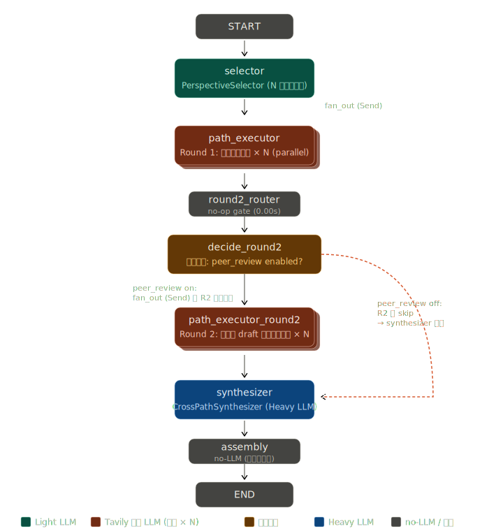
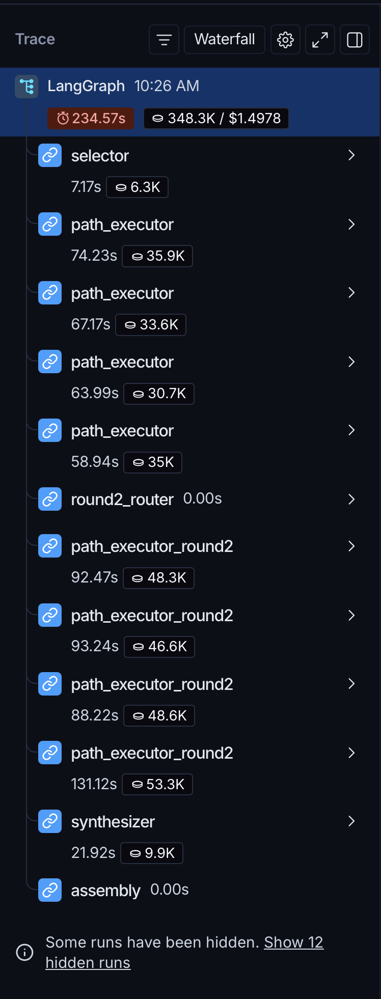
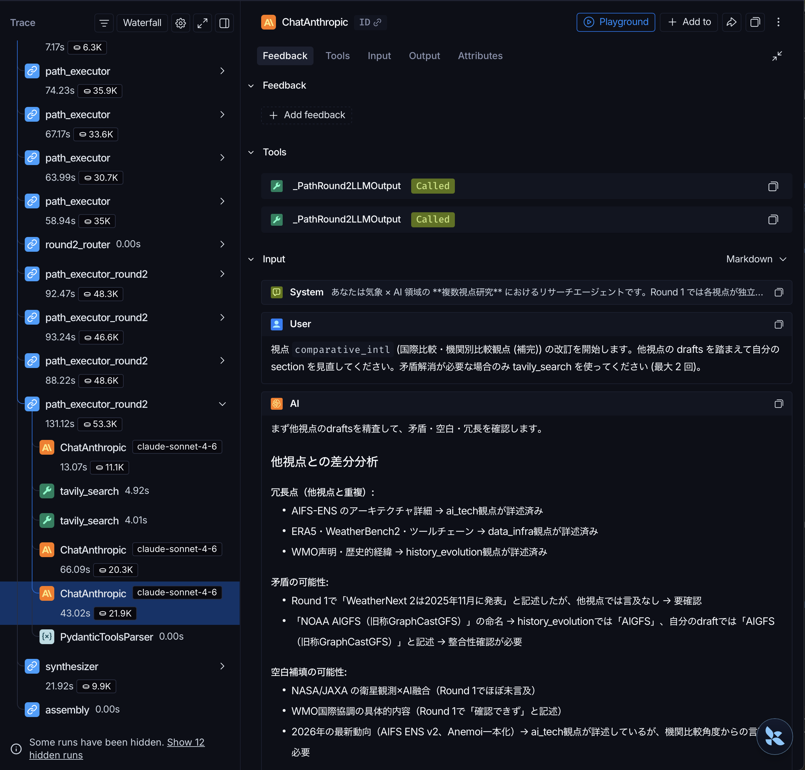

# langgraph-peer-review-agent

> 多経路 peer-review pattern による研究レポート生成 LangGraph エージェント

ユーザーの調査目標を入力に、curated な視点プールから 4 つの視点を選定し、各視点が **独立に Tavily 検索 + section 執筆** を行ったあと、**他視点のドラフトを参照して相互改訂 (peer-review)** することで、内部閉じた self/cross-reflection より強い fact verification 効果を実現する LangGraph エージェントです。気象 × AI ドメインに焦点を絞り、ECMWF・NOAA・Google DeepMind 等の権威ソースを Tier 構造で重み付けして参照します。

## 概要

LLM-as-a-Judge やマルチエージェント評価の研究が活発化する中、本実装では「**外部 grounded な複数 path が相互参照する**」という peer-review × grounding パターンを試みています。各 path は独立に Tavily 検索結果を own draft の根拠として持つため、Round 2 で他視点のドラフトを読んだとき、「自分は X と書いた、他視点は Y と書いている、どちらが正しいか Tavily で再検証する」という構造が成立します。同じ LLM が自分の出力を見直す self_reflection や、別 LLM が評価する cross_reflection では原理的に発見できない種類の事実誤認 (例: 大規模モデルのパラメータ数の桁ミス) が、本パターンでは検出・修正されることを smoke run で繰り返し観察しています。

実装には Claude Sonnet 4.6 をベースモデルとして用い、LangGraph の `Send` API による並列 fan-out、`conditional_edges` による Round 2 のスキップ判定、`Annotated[list, operator.add]` reducer による並列収集を組み合わせています。

> **サンプル出力**: 4 視点 × 2 ラウンドで生成された実例レポート
> (10,722 chars、Round 2 で WeatherNext 2 アーキテクチャ詳細・
> Anemoi 解像度などの fact-correction が観察される) は
> [examples/weather_ai_demo.md](./examples/weather_ai_demo.md) にあります。

## 特徴

- **並列 4 視点 + Round 2 相互改訂による fact-correction**: 4 視点を `Send` API で並列実行 (Round 1)、`round2_router` で peer-review 有無を判定し、Round 2 で各視点が他視点ドラフトを読んで改訂する 2-pass アーキテクチャ。実測 smoke run では 4/4 視点全てで Round 2 fact-correction が発生 (例: WeatherNext 2 のアーキテクチャ詳細、Anemoi training-ready ERA5 の解像度)。
- **Round 1 strict / Round 2 relaxed の段階的 Pydantic 制約**: `_PathLLMOutput.section_markdown` を Round 1 で max_length=1,700 (strict)、Round 2 用 `_PathRound2LLMOutput` で max_length=2,500 (relaxed) と非対称に設計。Round 1 の strict gate が下流のベースラインを構造的に保証し、Round 2 の改訂機会を保護する。
- **Prompt 規範による constant chasing 回避**: ハード制約 (max_length) ではなく prompt 規範 (「Round 2 は Round 1 への最小限の差分」「絶対基準ではなく相対基準で考える」) で LLM の意思決定起点に介入。constant chasing (上限を上げると上限まで使う傾向) を回避し、smoke run で Round 2 平均 Round 1 ± 200 字程度に収束。
- **視点間整合性のための粒度設計**: 並列実行で各 path が独立に Tavily 確認した日付情報が同一レポート内で日単位で食い違う事象に対し、prompt で「日付は月単位 default、日単位は論文発表日のみ」と粒度を統一。
- **LangGraph StateGraph による orchestration**: `MultiPathPeerReviewState` を中心に、selector → (fan-out R1) → path_executor × N → round2_router → (fan-out R2 or skip) → synthesizer → assembly のグラフを構築。`Send` API による並列性と `conditional_edges` による A/B toggle (`--no-peer-review`) を両立。

## アーキテクチャ



selector が curated list (8 視点) から 4 視点を選定し、Round 1 で並列に下書きを生成、`round2_router` で peer-review 有無を判定して Round 2 (並列改訂) または synthesizer に直行、最後に assembly で最終 Markdown を組み立てます。各サブエージェント・State 構造の詳細は [docs/DESIGN.md](./docs/DESIGN.md) を参照してください。

## クイックスタート

### 必要な環境

- Python 3.10+ (3.12 推奨)
- [uv](https://docs.astral.sh/uv/getting-started/installation/) (Python パッケージマネージャー)
- Anthropic API キー (または OpenAI API キー)
- Tavily API キー
- LangSmith API キー (任意、トレース取得時に必要)

### インストール

```bash
git clone https://github.com/deepkick/langgraph-peer-review-agent.git
cd langgraph-peer-review-agent

# 仮想環境の作成 (Python 3.12 推奨)
uv venv --python 3.12 .venv
source .venv/bin/activate  # macOS/Linux

# 依存関係のインストール
uv pip install -r requirements.txt
```

### 環境変数の設定

`.env.example` を `.env` にコピーし、API キーを設定してください。

```bash
cp .env.example .env
# .env を編集して ANTHROPIC_API_KEY / TAVILY_API_KEY を設定
```

### 実行

```bash
# デモタスクで起動 (~4 min, ~$1.5)
python -m src.main --quick-test --llm anthropic

# 任意タスクで起動
python -m src.main --task "あなたの調査目標" --llm anthropic

# A/B 比較: peer-review (Round 2) を無効化
python -m src.main --quick-test --llm anthropic --no-peer-review
```

実行結果は `<repo_root>/results/<timestamp>_<llm>.md` に保存されます。

## 実行例

### ターミナル出力 (抜粋)

```
=== Run Configuration (multi_path_peer_review) ===
  LLM:            anthropic / claude-sonnet-4-6
  Pool:           8 perspectives (3 Core + 5 補完, select 4)
  N paths:        4 (parallel via Send API)
  Peer Review:    ENABLED (Round 2 will run)
  Tavily filter:  score >= 0.5

[INFO] Starting multi_path_peer_review graph...
  [selector] selected: ['ai_tech', 'data_infra', 'history_evolution', 'comparative_intl']
  [fan-out:R1] dispatching 4 parallel paths
    [path:ai_tech] done: 1381 chars, 4 sources
    [path:data_infra] done: 1155 chars, 5 sources
    [path:history_evolution] done: 1108 chars, 4 sources
    [path:comparative_intl] done: 1221 chars, 4 sources
  [round2_router] dispatching 4 parallel Round 2 paths
    [path_round2:ai_tech] done: 1759 chars, refs=['comparative_intl', 'data_infra'],
      notes='WeatherNext 2 のアーキテクチャを Google DeepMind 公式に基づき修正...'
    [path_round2:data_infra] done: 1379 chars, refs=['ai_tech', 'comparative_intl'],
      notes='Anemoi training-ready ERA5 の解像度を ECMWF 公式に基づき修正...'
    [path_round2:history_evolution] done: 1549 chars, refs=['ai_tech', 'data_infra', 'comparative_intl']
    [path_round2:comparative_intl] done: 1975 chars, refs=['ai_tech', 'data_infra', 'history_evolution']
  [synthesizer] done: intro 323 / cross 582 / conclusion 253 chars
  [assembly] final_report: 10722 chars

=== Summary ===
  Total elapsed:    235s (3.9 min)
  Path results R1:  4
  Path results R2:  4 (peer_review enabled)
  Final report:     10,722 chars
  Saved to:         results/20260509_103009_anthropic.md
```

4 視点全てで Round 2 改訂が発生し、`referenced_siblings` (本文中で参照した他視点 ID) と `revision_notes` (何をどう変えたか) が記録されている点に注目してください。例えば `data_infra` は `comparative_intl` 視点と `ai_tech` 視点の Round 1 ドラフトを読み、Anemoi の解像度誤記を Tavily 再検索で訂正しています。

### 生成されたレポート (冒頭抜粋)

```markdown
## はじめに

本レポートは「GraphCast 以降の AI 気象予報モデルの技術系譜と ECMWF AIFS・
NOAA GraphCastGFS・Google WeatherNext の最新動向」という目標を、4 つの視点
から多角的に照射する。**AI/ML 技術観点** はアーキテクチャの進化と手法的革新
を、**データ・観測インフラ観点** は学習データ基盤とツールチェーンを、**歴史・
発展経緯観点** は NWP からの転換と国際標準化の流れを、**国際比較・機関別比較
観点** は主要 3 機関の戦略差異を担う。技術・データ・歴史・比較という 4 軸を
組み合わせることで、単一視点では見えない「なぜ今この技術が実運用に至ったか」
という全体像が浮かび上がる。
```

完全な実行結果は [examples/weather_ai_demo.md](./examples/weather_ai_demo.md) を参照してください。

## トレースと observability (LangSmith)

LangGraph の `Send` API による並列実行、Round 2 の peer-review 構造、各ノードの token 消費と所要時間は LangSmith で可視化できます。デモ実行のトレース全体ビュー (234.57s, 348.3K tokens, $1.4978):



selector → path_executor × 4 (Round 1, 並列) → round2_router → path_executor_round2 × 4 (Round 2, 並列) → synthesizer → assembly のグラフ構造が時系列で可視化されます。Round 2 の各 path は他視点の Round 1 ドラフトを読んで改訂するため、token 消費が Round 1 (~30-36K each) より大きく (~46-53K each) なっている挙動も観察できます。

各 Round 2 path executor の詳細では、AI が他視点ドラフトを読んで実施した差分分析 (冗長点・矛盾の可能性・空白補填の可能性) と Tavily 再検索が確認できます:



prompt 設計の改善箇所、fact-correction が機能している証拠、定数チェイシング回避の効果などを、コード外から直接観察できる点が本実装の検証可能性を高めます。

## 設計のハイライト

### 1. 多経路 peer-review × grounding パターン

各 path が独立に Tavily 検索結果を own draft の根拠として持つため、他視点との相互参照で「自分は X、他視点は Y、Tavily で再検証する」という構造が成立する。同じ LLM が自分の出力を見直す self_reflection や、別 LLM が評価する cross_reflection では原理的に発見できない事実誤認 (パラメータ数の桁ミス、運用化時期の年ズレ等) が、本パターンでは検出・修正される。

### 2. Round 1/Round 2 非対称制約設計

Round 1 (`_PathLLMOutput.section_markdown` max_length=1,700, strict) と Round 2 (`_PathRound2LLMOutput.section_markdown` max_length=2,500, relaxed) で構造的制約を非対称に設計し、Round 1 の strict gate が下流のベースラインを保証することで Round 2 の relaxation が defense-in-depth を破らない階層的依存関係を構築。Round 1 と Round 2 を同じ制約で動かして Round 2 の改訂機会が剥奪される問題を回避している。

### 3. 規範ベース response 制御

LLM (特に Sonnet) が `max_length` を「使ってよい上限」と解釈する constant chasing 問題に対し、ハード制約ではなく prompt 規範 ‒ 「Round 2 はゼロから書き直すのではなく Round 1 への最小限の差分」「絶対基準でなく相対基準 (Round 1 ± 200 字)」 ‒ で LLM の意思決定起点に介入。構造的限界点に到達する前に挙動を抑制する。文字数だけでなく表記・時間・粒度といった他領域にも展開可能。

各原則の詳細・適用条件・エビデンスは [docs/DESIGN.md](./docs/DESIGN.md) を参照してください。

## 技術スタック

- **オーケストレーション**: LangGraph (StateGraph、`Send` API による fan-out、`conditional_edges`、`Annotated[list, operator.add]` reducer)
- **LLM 連携**: LangChain (Anthropic / OpenAI、`with_structured_output`、`bind_tools` の手動ループパターン)
- **検索 grounding**: Tavily (`langchain-tavily`、score 閾値フィルタ + Tier 構造プロンプト)
- **データバリデーション**: Pydantic v2 (`max_length`、`Literal` 型による視点 ID 制約、`field_validator` で重複検出)
- **モデル**: Claude Sonnet 4.6 (default、Light/Heavy 共通)、または GPT (OpenAI バックエンド切り替え)

## ディレクトリ構成

```
langgraph-peer-review-agent/
├── README.md                    # 本ファイル
├── LICENSE                      # MIT
├── requirements.txt
├── .env.example
├── .gitignore
├── src/
│   ├── __init__.py
│   ├── main.py                  # CLI / orchestrator / 各サブエージェント
│   ├── models.py                # Pydantic State / 出力型
│   ├── perspectives.py          # 視点プール (8) と DOMAIN_CONTEXT
│   ├── settings.py              # API キー / モデル設定 / get_llm()
│   ├── output_saver.py          # 結果 Markdown 保存
│   └── search_tool.py           # Tavily ツールラッパー
├── examples/
│   └── weather_ai_demo.md       # 実行結果サンプル
├── docs/
│   └── DESIGN.md                # 設計 5 原則の詳細
├── assets/
│   └── architecture.svg         # アーキテクチャ図
└── tests/
    ├── quick_test_path_round2.py    # PathExecutorRound2 単体テスト (LLM 必要)
    └── quick_test_send_round2.py    # グラフ配線テスト (LLM 不要)
```

## ライセンス

[MIT License](./LICENSE)
